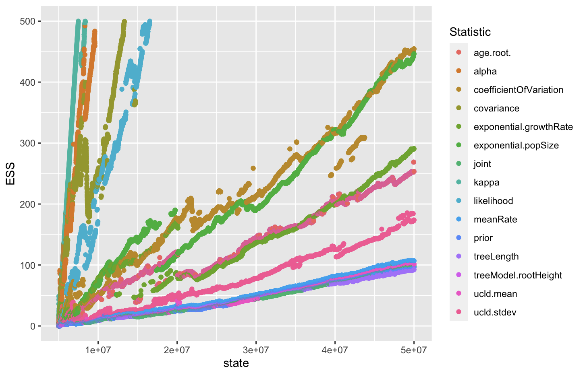
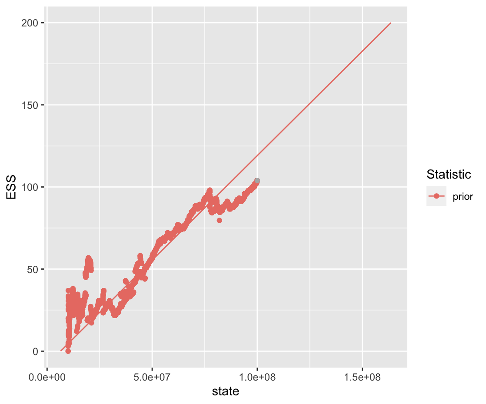

# ESS predict 


```R
source('ESSpredict.R')
log <- read.logFile('logs/4.2.1-het-strict.aln.log')
target <- 200
burnin <- 0.1
essdf <- cumESS(log, cores = 6, burnin = burnin)
plotESS(essdf)
```


```R
fit <- stepsUntil(essdf, target)
Statistic_below_ESS <- setdiff(unique(essdf$Statistic), unique(essdf[essdf$ESS > target,]$Statistic))
for (stat in Statistic_below_ESS) {
  p <- plotESS(
      essdf[essdf$Statistic == stat,][essdf[essdf$Statistic == stat,]$ESS < target, ], 
      fit=fit[fit$Statistic == stat,])
  print(p)
}
```
